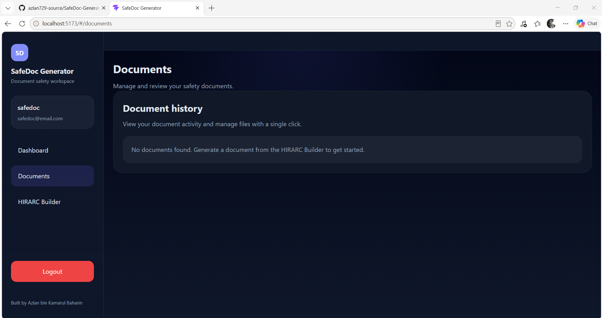

<!-- Project README for SafeDoc Generator -->

# SafeDoc Generator

  

---

## Overview

SafeDoc Generator is a lightweight SaaS-style safety document management platform focused on generating and managing HIRARC (Hazard Identification, Risk Assessment and Risk Control) documents. This repository contains an MVP built to learn and demonstrate full‑stack development and to digitize basic safety workflows for small teams.

Key goals:
- Provide a compact, dark-themed UI for building HIRARC rows
- Preview structured JSON payloads before saving
- Store documents via a simple Express + PostgreSQL API

---

## Features

- ✅ User authentication (JWT-based)
- ✅ Protected routes (frontend routing guards)
- ✅ Dashboard showing summary and quick actions
- ✅ Document management (create, list, view, delete)
- ✅ HIRARC Builder with grouped row inputs (compact card/accordion style)
- ✅ JSON payload preview for each document
- ✅ Responsive dark UI (Vite + React + global CSS)
- ⚙️ Foundation for role-based access (project structure and middleware prepared)

> Notes: A server-side PDF utility exists to render documents to PDF; frontend PDF export UI is work-in-progress.

---

## Tech Stack

- Frontend: React, Vite, CSS
- Backend: Node.js, Express.js
- Database: PostgreSQL (Sequelize ORM)
- Auth: JWT (JSON Web Tokens)

---

## Project Structure

Top-level folders:

- `backend/` — Express API, authentication, document routes, services and DB models.
- `frontend/` — Vite + React application, UI components, pages, and client services.

Brief purpose:

- `backend/` handles data persistence, validation, authentication, and document endpoints.
- `frontend/` provides the interactive UI (dashboard, HIRARC builder, previews) and consumes the API.

---

## Screenshots

### Login Page


### Dashboard


### Documents Page


### HIRARC Builder


---

## API Endpoints

The API is mounted under `/api`.

| Method | Endpoint | Description |
|---|---|---|
| POST | `/api/auth/register` | Register a new user |
| POST | `/api/auth/login` | Login and receive a JWT |
| GET  | `/api/auth/profile` | Retrieve authenticated user's profile |
| GET  | `/api/documents` | List documents (requires auth) |
| POST | `/api/documents` | Create a document (requires auth) |
| GET  | `/api/documents/:id` | Get a single document by id (requires auth) |
| DELETE | `/api/documents/:id` | Delete a document (requires auth) |

Server also exposes preview and PDF endpoints for documents:

| GET | `/api/documents/:id/preview` | Server-side rendered document preview |
| GET | `/api/documents/:id/pdf` | Download document as PDF (backend utility) |

---

## Installation

Clone the repo and install dependencies for both backend and frontend.

```bash
git clone <your-repo-url>
cd safetydoc-generator
```

Backend (API):

```bash
cd backend
npm install
# configure backend/.env (DATABASE_URL, JWT_SECRET, PORT)
npm run dev
```

Frontend (UI):

```bash
cd frontend
npm install
# configure frontend environment if needed
npm run dev
```

Note: The backend expects a PostgreSQL database and appropriate environment variables. See `backend/config/database.js` for DB configuration.

---

## Usage

1. Start backend and frontend as above.
2. Register an account and log in.
3. Open the HIRARC Builder to create new safety rows and preview the JSON payload.
4. Save a document to persist to the database and view it in the Documents list.

---

## Future Improvements

- PDF & export UI integration (frontend trigger)
- Excel/CSV export for reports
- Advanced HIRARC scoring matrix & reporting
- Search, filtering and pagination for documents
- Role-based permissions and team management
- Safety plan, PTW and checklist generators

---

## Contributing

Contributions are welcome. Please open issues for bugs or feature requests and submit PRs against `main`.

---

## Author

Azlan bin Kamarul Baharin ✨

- Site Safety Supervisor
- Full Stack Developer (Learning portfolio)

---

If you want me to add screenshots or tweak wording for your portfolio, tell me which images to include and I’ll update the README.
