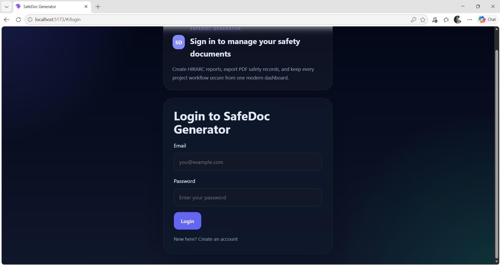
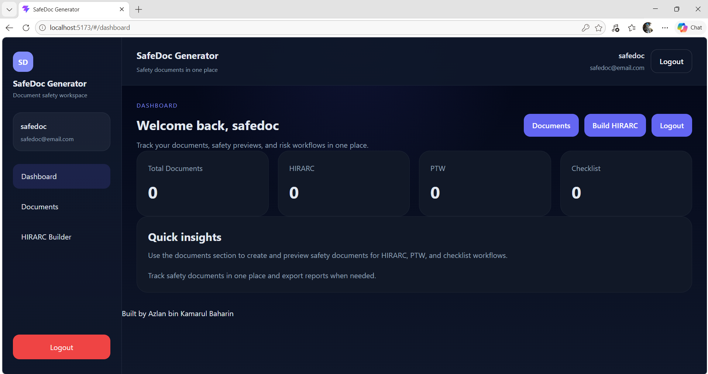
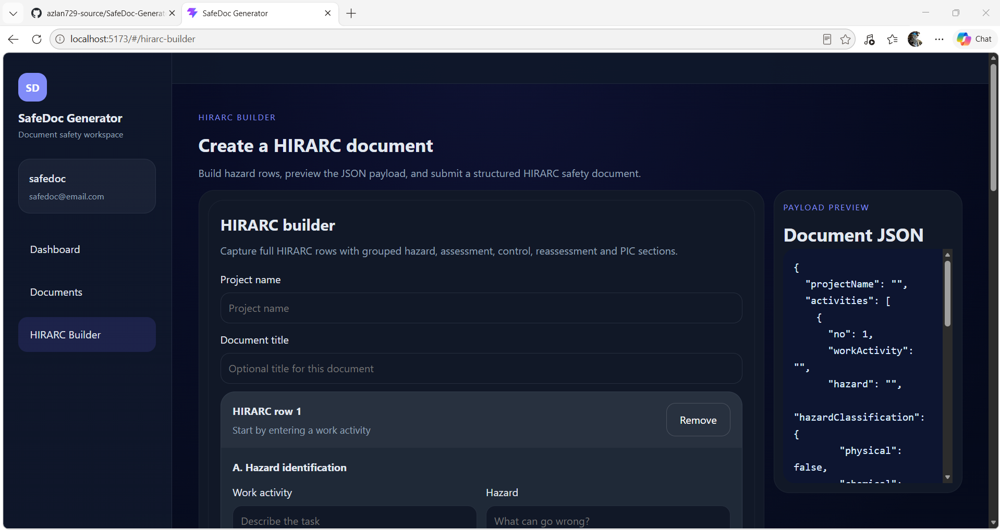

# SafeDoc Generator

SafeDoc Generator is a SaaS-style safety document management system built for construction and engineering teams. It helps users create, manage, preview, and export safety documents such as HIRARC reports with a modern responsive interface.

## Features

- Login / Register with JWT authentication
- Protected dashboard for managing safety documents
- HIRARC builder for hazard identification, risk assessment, and control planning
- Document listing with preview and delete actions
- JSON payload preview for structured document data
- PDF export for generated documents
- Responsive SaaS-style UI built with React and Vite

## Tech Stack

- React + Vite
- Node.js
- Express.js
- PostgreSQL
- Sequelize
- JWT Authentication

## Installation

1. Clone the repository:
   ```bash
   git clone <your-repo-url>
   cd safetydoc-generator
   ```
2. Install backend dependencies:
   ```bash
   cd backend
   npm install
   ```
3. Install frontend dependencies:
   ```bash
   cd ../frontend
   npm install
   ```
4. Create environment files:
   - `backend/.env`
   - `frontend/.env`

5. Configure backend `.env` with database and JWT settings.
6. Start the backend server:
   ```bash
   cd ../backend
   npm run dev
   ```
7. Start the frontend app:
   ```bash
   cd ../frontend
   npm run dev
   ```

## Troubleshooting

- **Port in use (EADDRINUSE):** If starting the backend shows an error like `listen EADDRINUSE: address already in use`, another process is already using the configured port (default `3000`).

   - Change the port in `backend/.env` (create the file if missing):

      ```env
      PORT=4001
      ```

   - Or start the backend with an overridden port (temporary):

      PowerShell:
      ```powershell
      $env:PORT=4001; npm run dev
      ```

      CMD:
      ```cmd
      set PORT=4001&& npm run dev
      ```

   - To free the port on Windows you can find and kill the process:

      ```powershell
      netstat -ano | findstr :3000
      taskkill /PID <PID> /F
      ```

   These steps are simple and beginner-friendly — changing `PORT` is the quickest fix.

## Project Structure

```
SafeDoc Generator/
├── backend/             # Express API, authentication, document routes
│   ├── controllers/
│   ├── middleware/
│   ├── models/
│   ├── routes/
│   ├── services/
│   ├── config/
│   └── server.js
├── frontend/            # React app with Vite, routes, and UI components
│   ├── src/
│   ├── public/
│   └── vite.config.js
├── Docs/                # Project documentation and design notes
└── README.md            # Project overview and setup instructions
```

## Screenshots

### Login


### Dashboard


### HIRARC Builder


## Future Improvements

- Add user profile and account settings
- Add document search and filtering
- Add export options for Excel and CSV
- Add real-time collaboration or team management
- Improve document templates and UI animations

## Author

Azlan bin Kamarul Baharin
